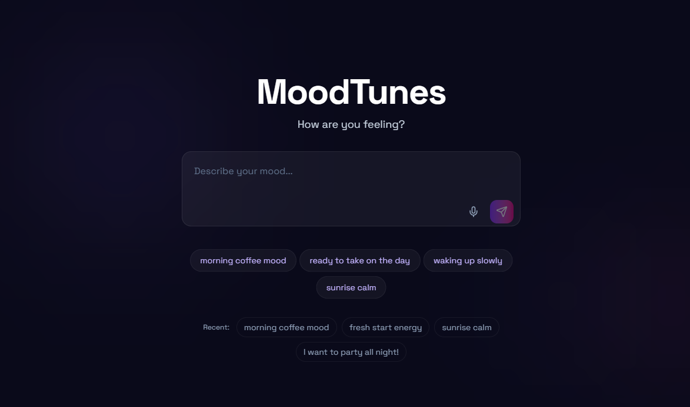
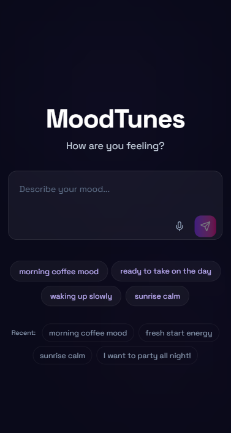

# MoodTunes - AI-Powered Mood-Based Music Discovery

MoodTunes is a portfolio-grade web application that turns how you feel into a personalized Spotify playlist. Type or speak your mood, and an AI pipeline detects 28 distinct emotions, generates tailored search queries, and curates a playlist with a written explanation of the vibe.

<p align="center">
  
</p>

### Live demo: [https://moodtunes.adibdev.me/](https://moodtunes.adibdev.me/)

---

## Highlights

- **28-emotion analysis** - Powered by `SamLowe/roberta-base-go_emotions`, MoodTunes detects nuanced emotional states (admiration, nostalgia, optimism, grief, and 24 more) instead of the usual 6-emotion buckets.
- **LLM-curated playlists** - A free HuggingFace-hosted LLM (Qwen 2.5 / Mistral) reads your mood and generates creative Spotify search queries plus a one-sentence playlist description, no hardcoded keyword lists.
- **Radial emotion visualization** - A custom-built bar chart shows your top 8 emotions with their relative weights, color-coded per emotion.
- **Mood-reactive ambient UI** - Floating gradient orbs in the background shift colors based on detected emotions, creating a dynamic atmosphere.
- **Two-view cinematic layout** - Centered input view transitions smoothly into a split results view (emotion chart + track list).
- **Voice input** - Speak your mood using the Web Speech API, with graceful fallback for unsupported browsers.
- **Time-aware smart prompts** - Suggestion chips adapt to the time of day (morning coffee vibes, late-night drives, etc.).
- **Fully responsive** - Built mobile-first with breakpoints for tablet and desktop.
- **Production-ready** - TypeScript strict mode, Biome for linting/formatting, in-memory rate limiting, Spotify token caching, comprehensive fallback chain.

---

<details>
<summary><b>📸 Screenshots</b> - click to expand</summary>

<br>

<table>
  <tr>
    <td align="center"><b>Desktop</b></td>
    <td align="center"><b>Mobile</b></td>
  </tr>
  <tr>
    <td></td>
    <td></td>
  </tr>
</table>

</details>

---

## Tech Stack

| Layer        | Technology                                                 |
| ------------ | ---------------------------------------------------------- |
| Framework    | Next.js 16 (App Router) + React 19                         |
| Language     | TypeScript (strict mode)                                   |
| Styling      | Tailwind CSS 4, Framer Motion 12                           |
| AI - Emotion | HuggingFace `SamLowe/roberta-base-go_emotions` (28 labels) |
| AI - LLM     | HuggingFace Inference Providers (Qwen 2.5 / Mistral 7B)    |
| APIs         | Spotify Web API, Web Speech API                            |

---

## How It Works

```
User text/voice
    │
    ▼
┌─────────────────────────────┐
│ 28-emotion classification   │  SamLowe/roberta-base-go_emotions
│ (HuggingFace)               │
└─────────────────────────────┘
    │
    ▼
┌─────────────────────────────┐
│ LLM mood interpretation     │  Qwen 2.5 / Mistral via HF
│ → mood summary              │
│ → 5-8 search queries        │
│ → playlist description      │
└─────────────────────────────┘
    │
    ▼
┌─────────────────────────────┐
│ Parallel Spotify search     │  Spotify Web API
│ (token cached in memory)    │
└─────────────────────────────┘
    │
    ▼
┌─────────────────────────────┐
│ Single API response:        │
│ emotions[], mood, playlist  │
└─────────────────────────────┘
```

The entire pipeline runs server-side through a single `/api/generate` endpoint with rate limiting (20 req/min per IP) and a three-stage fallback chain:

1. **Primary:** 28-emotion model + LLM-generated queries
2. **Fallback A:** 28-emotion model + keyword-based query mapping
3. **Fallback B:** Keyword-based emotion detection + keyword query mapping

---

## Getting Started

### Prerequisites

- Node.js 22+
- pnpm 9+
- A Spotify Developer account ([dashboard](https://developer.spotify.com/dashboard))
- A HuggingFace account with an Inference API token ([settings](https://huggingface.co/settings/tokens))

### Setup

```bash
# Clone the repository
git clone https://github.com/Adib23704/MoodTunes.git
cd MoodTunes

# Install dependencies
pnpm install

# Create your environment file
cp .env.example .env.local
```

Edit `.env.local` and fill in your credentials:

```env
SPOTIFY_CLIENT_ID=your_spotify_client_id
SPOTIFY_CLIENT_SECRET=your_spotify_client_secret
HUGGINGFACE_API_KEY=your_huggingface_api_key
```

### Run the development server

```bash
pnpm dev
```

Open [http://localhost:3000](http://localhost:3000) and try a mood like _"I'm feeling kind of nostalgic but hopeful about tomorrow"_ - see the full pipeline in action.

---

## Available Scripts

| Command          | What it does                                  |
| ---------------- | --------------------------------------------- |
| `pnpm dev`       | Start the development server (with Turbopack) |
| `pnpm build`     | Build the production bundle                   |
| `pnpm start`     | Run the production build locally              |
| `pnpm lint`      | Lint with Biome                               |
| `pnpm lint:fix`  | Lint and auto-fix with Biome                  |
| `pnpm format`    | Format files with Biome                       |
| `pnpm typecheck` | Run TypeScript type check                     |
| `pnpm validate`  | Format + lint + typecheck (used in CI)        |

---

## Project Structure

```
src/app/
├── api/
│   └── generate/route.ts        # Unified API endpoint
├── components/
│   ├── AmbientBackground.tsx    # Floating gradient orbs
│   ├── EmotionChart.tsx         # Radial bar chart of 28 emotions
│   ├── LoadingState.tsx         # Pulsing rings loading animation
│   ├── MoodInput.tsx            # Textarea + voice (expanded/compact modes)
│   ├── MoodSummary.tsx          # AI-generated mood label + description
│   ├── RecentMoods.tsx          # localStorage-backed mood pills
│   ├── SmartPrompts.tsx         # Time-aware suggestion chips
│   └── TrackList.tsx            # Glassmorphism track rows
├── types/
│   └── index.ts                 # Shared TypeScript types
├── utils/
│   ├── emotionAnalyzer.ts       # 28-emotion HuggingFace wrapper
│   ├── llm.ts                   # LLM client (Qwen → Mistral fallback)
│   ├── fallback.ts              # Keyword-based emergency fallback
│   ├── rateLimit.ts             # In-memory sliding-window rate limiter
│   └── spotify.ts               # Spotify token caching + search
├── globals.css                  # Dark theme + glassmorphism utilities
├── layout.tsx                   # Root layout (Space Grotesk font)
└── page.tsx                     # Two-view state machine
```

---

## Architecture Decisions

- **Single API endpoint** - One `POST /api/generate` call orchestrates the full pipeline. The frontend doesn't need to coordinate multiple sequential requests.
- **No database** - Stateless, all data flows through HuggingFace and Spotify APIs.
- **In-memory token caching** - Spotify access token is cached at module level with a 5-minute expiry buffer. Eliminates redundant auth round-trips on serverless instances.
- **Parallel Spotify queries** - LLM-generated queries are executed in parallel via `Promise.all`, then deduplicated and sorted by popularity.
- **Three-stage fallback** - If the LLM fails, falls back to emotion-based query mapping. If the emotion model fails, falls back to keyword detection. The app never returns an empty result.
- **TypeScript strict mode** - All code is strictly typed, no `any` escape hatches except where absolutely required by third-party API responses.
- **Biome over ESLint** - Faster linting and formatting in a single tool, no configuration sprawl.

---

## Credits

- [Spotify Web API](https://developer.spotify.com/) - track data and search
- [HuggingFace Inference Providers](https://huggingface.co/docs/inference-providers/) - emotion classification and LLM hosting
- [`SamLowe/roberta-base-go_emotions`](https://huggingface.co/SamLowe/roberta-base-go_emotions) - 28-emotion model
- [Next.js](https://nextjs.org/), [Tailwind CSS](https://tailwindcss.com/), [Framer Motion](https://www.framer.com/motion/), [Biome](https://biomejs.dev/), [Lucide](https://lucide.dev/)

---

## License

[MIT](LICENSE)

---

## Contributing

Issues and pull requests are welcome. If you're adding a feature, open an issue first to discuss the approach.
